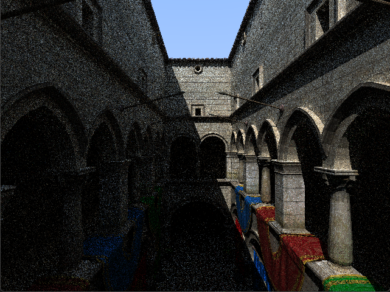

# C++ Pathtracer

This project was written with the intention of learning more about raytracing and how commercial 
pathtracers improve their performance. The project is intended to run on the CPU and focuses on improvements
which I found interesting from research papers on the topic. 

  

## Features

- Model loading code for obj files
- Four versions of TraceRay provided (Scalar, SSE-only, BVH2, BVH4)
- BVH2 with surface area heuristics to achieve the best possible splits
- BVH4 improved with SSE intrinsics for node traversal and intersections
- Lambertian BRDF (Will switch to something better later)
  
## How To Run

The project was made with Visual Studio 2026 and is intended to run within that environment.

In it's current state, you should be able to simply clone the latest version of the master branch and run
it from Visual Studio. 

The project allows the user to modify the number of samples per pixel and the amount of recursive pathtrace calls.
This is done in the file Renderer.cpp using the variables "depth" and "numSamples". 

The project provides four versions of raytracing functions, which are as follows:

- TraceRayNonBVH - Scalar version
- TraceRay4NonBVH - SSE version, with no BVH 
- TraceAgainstBVH2 - Two-node BVH, no SSE
- TraceAgainstBVH4 - Four-node BVH, with SSE for traversal and intersection

In order to switch between the separate versions, you will find four macros 
that control which version you use at the top of Renderer.cpp. Uncomment the 
one you wish to run, but make sure it is the only active macro. 

## Camera Controls

- Use the AWSD keys to move the camera Forward, Backward, Left and Right.
- Use the Q and E keys to move Up and Down.
