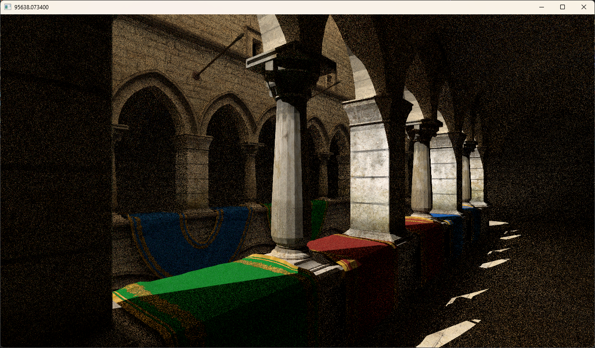
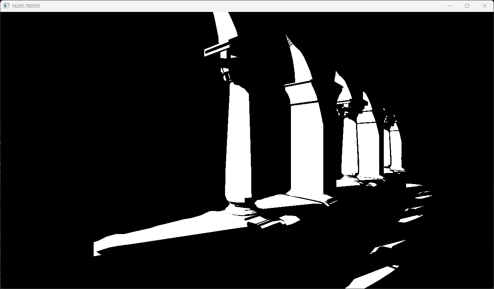
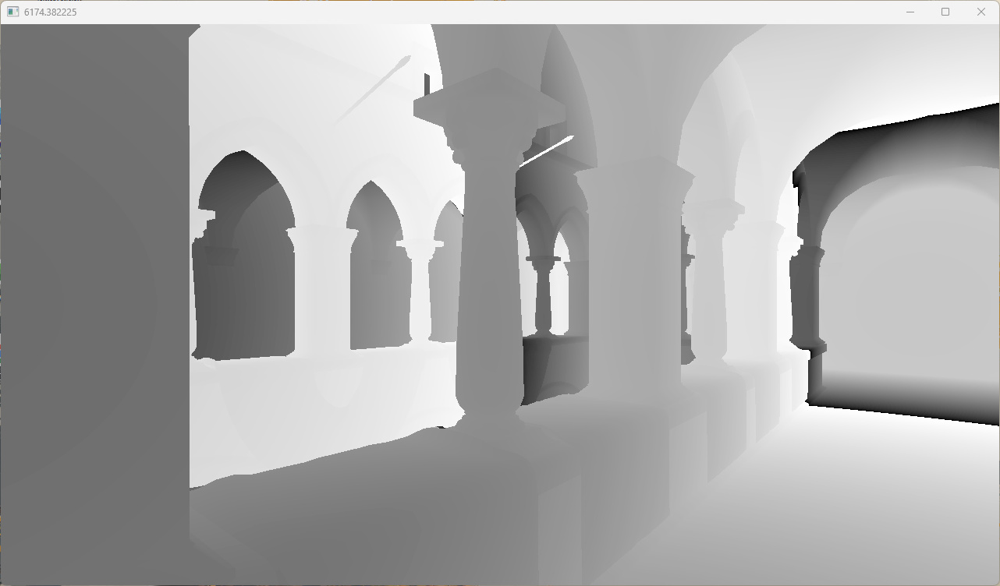
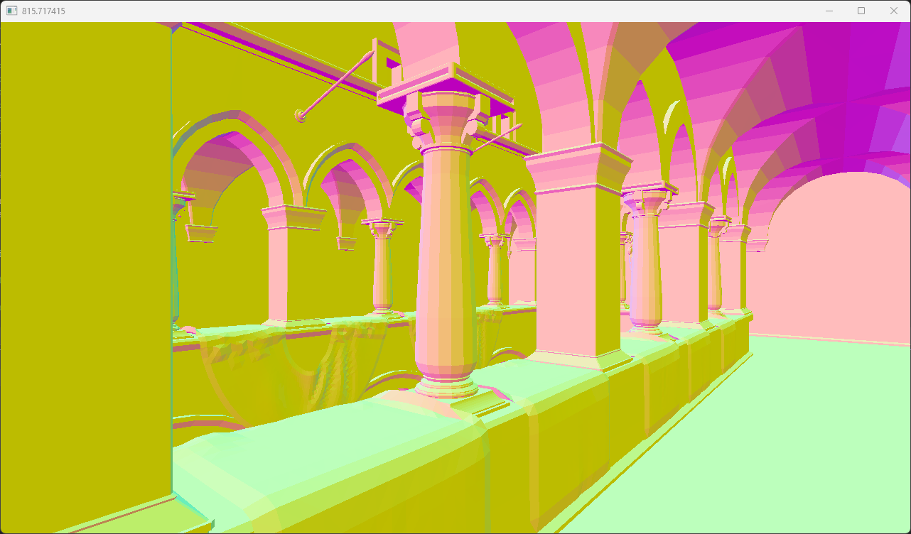
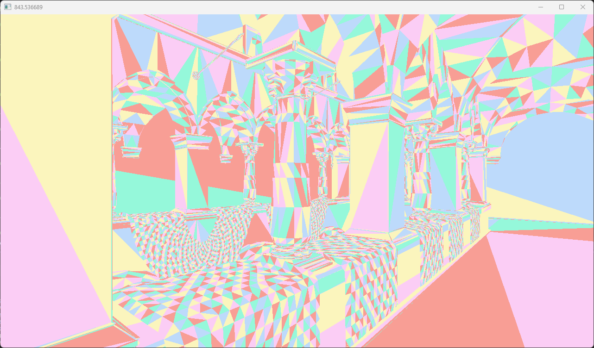
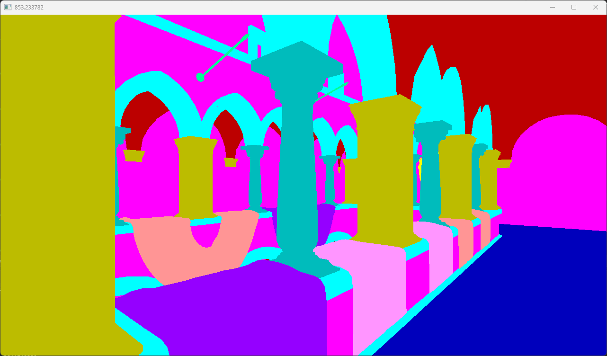
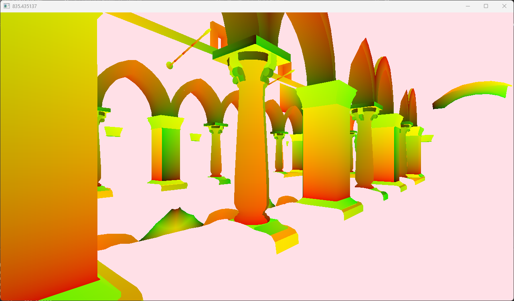

# C++ Pathtracer

The project was written with the intention of learning more about raytracing. It focused mainly on understanding
how modern pathtracers structure their architecture and improve performance. Most of the techniques were obtained
by existing literature on these topics. 

  

## Features

- A model loader capable of reading OBJ files.
- Four acceleration structures, which can be viewed separately (Scalar, SSE-only, BVH2, BVH4).
- Both bounding volume implementations use a Surface Area Heuristic to determine an optimal node split.
- Intersections and BVH traversal for the BVH4 utilizes SSE intrinsics.
- Lambertian BRDF
  
## How To Run

The project was created with Visual Studio 2026 and is intended to run within that environment.

In it's current state, you should be able to simply clone the latest version of the master branch and 
run directly in Visual Studio. 

As mentioned, the project has implemented four versions of acceleration structures. In order to toggle
between the version you wish to run, four macros have been provided, at the top of **Pathtracer.cpp**. The macros
are as follows:

- RENDER_SCALAR - Scalar version, loops over each triangle
- RENDER_SSE - SSE version, loops over four triangles at once
- RENDER_BVH2 - Two-node BVH
- RENDER_BVH4 - Four-node BVH, allowing SSE to optimize traversal and intersection

When switching between versions with the macros, make sure only one of them is active at a time, otherwise
you would be running multiple versions at once.

The project also provides two macros, also found in Pathracer.cpp, to control the number of bounces and the samples
per pixel. The "bounces" macro controls the number of Pathrace calls processed. Each pathtrace is a pairing of a primary
ray and a corresponding shadow ray. The "sample" macro controls the number of rays spawned per pixel. 

## Camera Controls

- Use the AWSD keys to move the camera Forward, Backward, Left and Right.
- Use the Q and E keys to move Up and Down.

## Debug views

As I was working on the project, debug views became more neccessary. The keys from Z to M provide some useful 
debugging visualizations. 

- In Shadow (Z)
- Depth (X)
- Normals (C)
- Triangle ID (V)
- Material ID (B)
- Texture Coordinates (N)
- Diffuse/Surface Colour (M)

<table>
  <tr>
    <td></td>
    <td></td>
    <td></td>
  </tr>
  <tr>
    <td></td>
    <td></td>
    <td></td>
  </tr>
</table>
